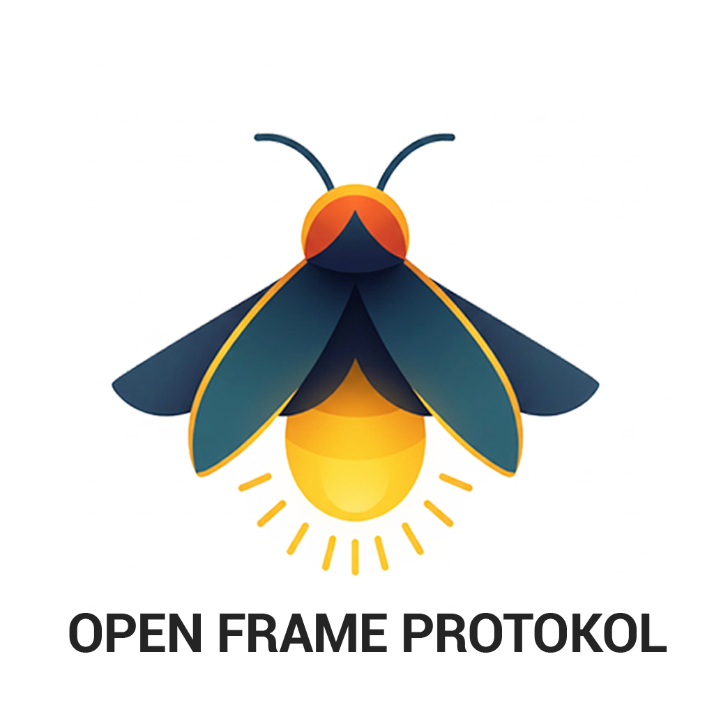

# OpenFrameProtocol (OFP)

  

A secure, high-performance communication protocol implementation built on top of QUIC (Quick UDP Internet Connections) with mutual TLS authentication and heartbeat mechanisms.

## What is OpenFrameProtocol?

OpenFrameProtocol (OFP) is a modern, secure communication protocol designed for high-performance applications requiring reliable and encrypted data transmission. Built on the foundation of QUIC, OFP provides a robust framework for building secure client-server applications with automatic certificate management and connection health monitoring.

## Key Features

- 🔒 **Mutual TLS Authentication**: Both server and client require certificates for secure communication
- 🚀 **QUIC Protocol**: Modern transport protocol with built-in encryption and multiplexing capabilities
- 💓 **Heartbeat System**: Automatic connection keep-alive mechanism to monitor connection health
- 📦 **Frame-Based Architecture**: Structured protocol with support for different frame types
- 🔐 **Auto-Generated Certificates**: Automatic certificate authority and certificate generation
- 🎨 **User-Friendly Interface**: Beautiful server startup banner with connection information

## Why OpenFrameProtocol?

OpenFrameProtocol combines the best of modern networking technologies:

- **Security First**: Mutual TLS authentication ensures that only authorized clients can connect
- **High Performance**: QUIC protocol provides low latency and efficient multiplexing
- **Easy to Use**: Automatic certificate generation eliminates complex setup procedures
- **Production Ready**: Built-in heartbeat mechanism ensures reliable connection monitoring

## Use Cases

OFP is ideal for:
- Secure client-server applications
- Real-time communication systems
- IoT device management
- Microservices communication
- Any application requiring secure, reliable data transmission

## Roadmap

OpenFrameProtocol will be released soon with comprehensive SDK support for a wide range of platforms and architectures:

- **IoT Devices**: Lightweight SDKs for embedded systems and IoT devices
- **Microservices**: Native SDKs for microservices architectures
- **Cloud Platforms**: SDK support for major cloud providers
- **Mobile Platforms**: iOS and Android SDKs
- **Web Applications**: JavaScript/TypeScript SDK for browser and Node.js environments
- **Enterprise Systems**: SDKs for enterprise-grade applications

Our goal is to make OpenFrameProtocol accessible across all modern development environments, from resource-constrained IoT devices to large-scale microservices architectures.

## Security

OpenFrameProtocol prioritizes security through:
- **Mutual TLS Authentication**: Both parties must authenticate
- **Strong Encryption**: Industry-standard encryption mechanisms
- **Certificate Validation**: Automatic verification of client certificates
- **Secure by Default**: All connections are encrypted and authenticated

## Support & Contribution

We are open to support, contributions, and feedback! OpenFrameProtocol is a community-driven project, and we welcome:

- 🐛 **Bug Reports**: Help us improve by reporting issues
- 💡 **Feature Requests**: Share your ideas for new features
- 📝 **Documentation**: Help improve our documentation
- 🔧 **Code Contributions**: Contribute code improvements and new features
- ❓ **Questions & Support**: We're here to help with any questions

Your contributions help make OpenFrameProtocol better for everyone. We appreciate every form of support and are always open to collaboration!

---

  <em>Don't Panic</em>

